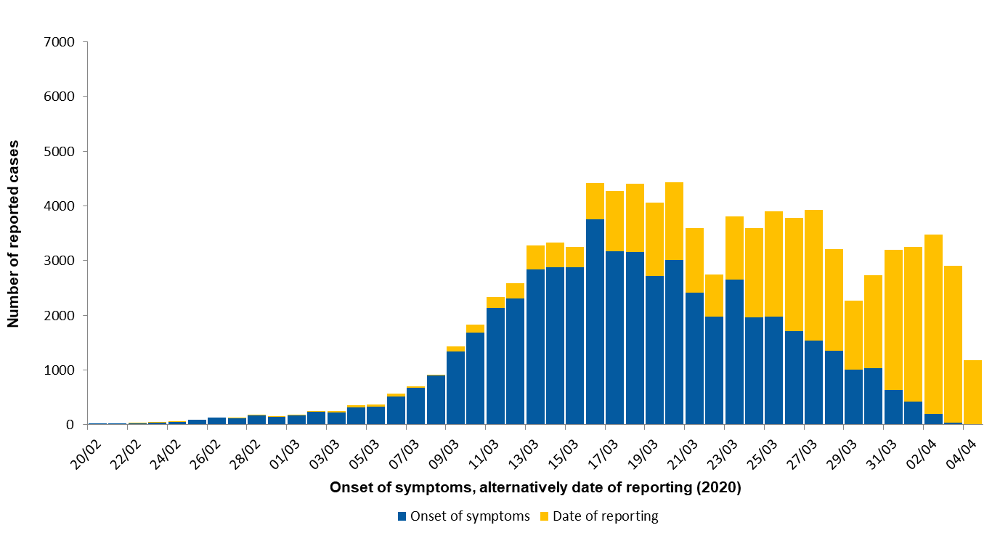

## Alapgondolat

A járványok alakulásának legalapvetőbb leírója a **járványgörbe**, ami megadja a betegek számának időbeli alakulását. Itt most azzal foglalkozunk, amikor a jelentett *esetszámot* vizsgáljuk, ez a legkézenfekvőbb lehetőség, ez a járvány alakulásának leginkább közvetlen, áttételek nélküli leírója. Kézenfekvősége ellenére is számos csapda van ebben elrejtve, amiket értenünk kell ahhoz, hogy megfelelően tudjuk értelmezni a járványgörbét. Nagyon fontos, hogy ezek a limitációk természetesen minden olyan elemzésre is ugyanúgy érvényesek, melyek az esetszámok görbéjén alapulnak (pl. reprodukciós szám becslése)!

Az első és a legfontosabb, hogy a koronavírus esetén a *jelentett* esetszám *drasztikusan*, akár nagyságrendileg is eltérhet a *tényleges* esetszámtól. Ennek az oka a betegség biológiája: sok ember van, ráadásul most még a pontos arányukat sem ismerjük, akiknél tünetszegényen, más betegséggel könnyen összetéveszthetően, vagy akár teljesen tünetmentesen zajlik a megbetegedés. Ez nem olyan, mint a kanyaró, hogy minden betegnek tünetei vannak, és szinte minden esetben ordítóan egyértelmű tünetei.

Ennek a folyománya, hogy a jelentett esetszámokat nagyon veszélyes önmagukban, az elvégzett tesztek száma nélkül értelmezni. Hiszen a tünetmentes, vagy nem egyértelmű tüneteket mutató eseteket csak a teszt fogja megtalálni! Ennek következtében, ha egy ország sokat tesztel, több ilyet is meg fog találni és jelent, míg aki keveset, azoknál ezek nem kerülnek bele a jelentésbe. Egyfelől tehát az országok közti összehasonlításnál erre mindig tekintettel kell lenni (simán lehet, hogy ha egy országban magasabb a jelentett esetszám az *jó*, mert azt jelenti, hogy sokat megtalálnak, míg ha valahol alacsony, az baj!), másrészt egy országon belül, időben is változhat a tesztelési aktivitás. Ha felfut a tesztek száma, megnőhet az esetszám, miközben a járványügyi helyzet nem lett rosszabb (ellenkezőleg, végre jobb képet kapunk), vagy fordítva, ha nem nő eléggé a tesztek száma, azt hisszük, hogy nincs is nagy baj (miközben nagyon is van).

Az utóbbi miatt felmerülhet az a kérdés, hogy akkor egyáltalán mi értelme az esetszámokra alapozott járványgörbét nézni, vagy abból bármit is számolni? Van, pontosabban szólva lehet értelme, ugyanis bár elképzelhető, hogy az abszolút számok rosszak, de a *relatív* viszonyok egy országon belül rendben lesznek, mindaddig persze, amíg a tesztelési aktivitás maga nem változik meg lényegesen az országban. Lehet, hogy tízszer annyi eset van a valóságban, de ha a jelentett számok nőnek/nem nőnek/csökkennek, akkor a valós számok is nőnek/nem nőnek/csökkennek, *mindaddig*, amíg a 10-es szorzó állandó. Természetesen, ha hirtelen elkezdünk sokkal többet tesztelni, akkor megugrik az esetszám anélkül, hogy a hátterében valódi változás lenne a járványügyi helyzetben, vagy fordítva, ha a tesztelési aktivitás nem tud lépést tartani a járvánnyal, akkor az esetszám növekedése látszólag lelassul vagy megáll, miközben a valódi helyzetre ez nem igaz; ez talán a legfontosabb dolog, ami miatt az esetszámokkal, és minden belőlük számolt adattal -- még egy országon belül is! -- óvatosnak kell lenni. A Tesztpozitivitás pont további segítséget ad ehhez a kérdéshez (hiszen az utóbbi helyzet egyik jó indikátora, hogy megnő a pozitívak aránya az elvégzett teszteken belül).

Bár korábban az szerepelt, hogy ez a "leginkább közvetlen" mutató, valójában ez sem teljesen igaz: *elvileg* a megfertőződés dátuma szerinti járványgörbe lenne az ideális. A jelentési időpont szerinti járványgörbe ugyanis késleltetve van: egyfelől a megfertőződéstől a tünetek jelentkezéséig eltelő idő, tehát a lappangási idő, másfelül a tünetek jelentkezésétől a regisztrálásig eltelő idő -- orvoshoz fordulásig eltelő idő, mintavételig eltelő idő, teszt kiértékeléséig eltelő idő stb. -- késlelteti.

Sajnos a megfertőződés időpontja a legtöbb esetben egyáltalán nem, vagy -- egy éppen zajló járvány körülményei között -- gyakorlatilag nem deríthető fel. Egy lehetőség azonban van, hogy közelebb kerüljünk az optimálishoz: ha nem a *betegség jelentésének* dátuma, hanem a a *tünetek fellépésének* dátuma szerint képezünk járványgörbét -- ez persze csak utólag tehető meg, de ezzel legalább a tünetek jelentkezésétől a regisztrálásig eltelő idő okozta késleltetés kiküszöbölhető, ha visszatekintve akarunk tisztább képet kapni.

A kettő közti különbséget látványosan mutatja a következő ábra, ami a német helyzetről készült:

A kék oszlopok a tünetek fellépése szerinti, a sárgák a jelentés dátuma szerinti görbét adják ki. Szépen látszik, hogy az új betegségkezdetek már március közepe óta csökkentek, miközben a jelentett esetszám még két hétig nem változik.

(Az e pontban látható járványgörbe -- mivel szemben Németországgal, Magyarországon nem érhető el másra vonatkozó adat -- a jelentés dátuma szerinti görbe.)

Mindezek végiggondolása egyébként egy rendkívül fontos járványügyi kérdésre is felhívja a figyelmet: azt, hogy bármilyen intézkedést is hozunk, annak a hatása kb. 2-3 hét múlva fog érvényesülni, hiszen ott van a lappangási idő, és a jelentésig eltelő idő. Ha például bevezetünk egy korlátozást, akkor lehet, hogy az *új* fertőzések száma azonnal lecsökken, de a lappangási idő alatt lévő, vagy épp a tesztre váró betegeket ez nem érinti, ezért a jelentett betegek száma -- mint a rendszer egyfajta tehetetlensége -- egy ideig még nem fog lemenni! Ugyanez persze azt is jelenti egyúttal, hogy amit a görbén látunk, az valójában a két héttel ezelőtti fertőződési helyzetet tükrözi.

A hivatalos adatközlések gyarkan azt adják meg, hogy adott időpontig *összesen* hány beteg volt -- ennek a szép neve: kumulált esetszám -- az epidemiológiai vizsgálatokhoz általában a napi esetszámra kell áttérni.

Elvileg a függőleges tengelyen az incidenciát, tehát a lakosság lélekszámával leosztott (pl. százezer főre jutó) esetszámot illene ábrázolni. Ha azonban a járvány gyors (hogy a születések és az egyéb okból bekövetkező halálozások ne változtassanak sokat) és nem extrém nagy halálozású (hogy magában a betegségben meghaltak ne változtassanak sokat), akkor nem követünk el nagy hibát, ha egyszerűen az esetszámot tüntetjük fel.

Az itt szereplő görbén a fekete pontok a tényadatokat jelentik, a kiválasztható kék görbe pedig a rájuk illesztett ún. simítógörbét. Ez egy olyan görbe, ami a véletlen ingadozásokat kisimítva, a görbe alaptrendjét igyekszik követni, de a nélkül, hogy bármit fel kellene tennünk arról, hogy mi a valódi alakja.

Más feladatokhoz viszont fontos lehet az is, hogy találjunk valamilyen, matematikailag ismert alakú függvényt, ami jól leírja a görbe alakulását. Ez két szempontból fontos. Egyrészt, ha a pontokra illeszkedik valamilyen görbe, akkor azt -- szemben a simítógörbével! -- meg tudjuk "hosszabbítani". (Hiszen ismerjük a függvényt, egyszerűen beleírunk egy jövőbeli dátumot.) Magyarul: előre tudunk vele jelezni! Fontos, hogy az ilyen előrejelzések inkább csak rövid távra alkalmasak; ennek részletei az Előrejelzés pontnál szerepelnek.

A másik fontos ok a függvényillesztésre az, hogy ha a pontok *tényleg* az adott függvényt követik, csak épp a véletlen miatt szóródva körülötte, akkor az illesztett függvény paraméterei bizonyos értelemben tisztán, az esetszámokban lévő ingadozás jelentette zajtól megtisztítva mutatják, hogy mi a helyzet, sőt, sok esetben ezeknek a paramétereknek valamilyen értelmes jelentése is van. (Például, ha a betegek száma exponenciálisan nő, akkor annak a növekedési rátája meghatározza a duplázódási időt: hogy hány naponként emelkedik kétszeresére a napi esetszám. Exponenciális növekedésnél ez ugyanis egy adott, állandó érték.)

Ebben a pontban illeszthető exponenciális függvény (ez tipikusan a betegségek kezdeti szakaszában megfelelő), hatványfüggvény, mely az exponenciálishoz hasonlóan folyamatosan nő, de lassabb ütemben, és logisztikus, mely egy platót leíró görbe, tehát a növekedés ütemében van egy csúcspont, ami után már egyre kevesebb az új beteg. (Tehát az összes eset száma továbbra is nő, de lassulva nő.)

Ami nagyon fontos lehet, hogy pontosan mely pontokra illesztjük a függvényt: szinte mindig igaz, hogy a járványgörbét nem egy nagyon függvényt írja le, hanem különböző szakaszai vannak. Például a járvány legeleje még máshogy viselkedik, ezért azt le kell választani a becslésből. Az is elképzelhető, hogy több szakasza van a járványnak, melyeknél külön-külön egy exponenciális görbére illeszkednek a pontok, de a különböző szakaszoknak más és más meredeksége. Az ilyen és ehhez hasonló helyzetekre használható az ablakozás: ekkor továbbra is valamennyi pontot látunk, de a görbe illesztése csak az ablakon belül lévő pontok alapján történik. (Így például lehagyható az első néhány pont, vagy kiválasztható egy adott szakasz.)

A simítógörbe azért is jól jön, mert lehetőséget ad a függvényillesztés jóságának a megítélésére: ha az illesztett függvény (mely adott függvényformához kötött) követi a simítógörbét (mely nem kötött függvényformához, szabadon követi a pontokat) az annak a jele, hogy jó függvényformát választottünk. Hogy ez jobban látszódjon, az ablakozás bekapcsolásakor halvány háttér jelzi, hogy mely területre illesztünk.

Beállítható, hogy a függőleges tengely logaritmikus beosztású legyen, ez azt jelenti, hogy ha felfelé lépdelünk a tengely mentén, akkor minden lépés ugyanannyi*szoros* (és nem ugyanannyi*val*) történő növekedést jelent; ez azért fontos, mert az exponenciálisnak megvan az a tulajdonsága, hogy ilyen skálázás mellett egy egyenes vonal lesz. (És emberi szemmel sokkal könnyebb egy egyenesre való illeszkedést megítélni.)

Minden esetben megjeleníthető az ún. konfidenciaintervallum, ez arról szolgáltat információt, hogy mennyire bizonytalan a görbe becslése. Hiszen ezeket a görbéket véges sok pont alapján határozzuk meg, amik helyzetében véletlen ingadozás is van, így a belőlük számolt görbékben is. Ezt szemlélteti a konfidenciaintervallum: minél szélesebb, annál bizonytalanabb ott a görbe értéke. (Precízen: a konfidenciaintervallum pontjai azok az értékek, amikre igaz, hogy ha az lett volna a valódi érték, akkor még kényelmesen kijöhetett -- a véletlen ingadozásra tekintettel -- az, ami a valóságban ténylegesen ki is jött. A konfidenciaintervallum megbízhatósági szintje szabályozza, hogy mit értünk "kényelmesen" alatt.)

## Matematikai részletek

### Függvényforma

Három függvényforma választható görbeillesztésre.

#### Exponenciális függvény

Jelölje a megbetegedések számát $t$ időben $X\left(t\right)$, ekkor a "növekedési ütem" magyarul a derivált, tehát az a kijelentés, hogy "a növekedési ütem a betegek számával arányos", így írható le matematikai formában:
\[
  \frac{\mathrm{d}X\left(t\right)}{\mathrm{d}t}=rX\left(t\right).
\]
Ez egy egyszerű differenciálegyenlet, melynek megoldása:
\[
  X\left(t\right)=ae^{rt},
\]
ahol az $r$ paraméter a növekedési ráta. Azaz valóban exponenciális függvényt kaptunk.

#### Hatványfüggvény

Az exponenciálistól elmaradó (szubexponenciális) növekedések egyik népszerű választása a hatványfüggvény:
\[
  X\left(t\right)=a t^b,
\]
ahol $b$ a hatványkitevő.

Itt kicsit nehezebb mechanikai magyarázatot adni arra, hogy hogyan jöhet ez ki a járvány kezdeti szakaszában is, TODO

#### Logisztikus

TODO

### Becslés

Alapvetően két út között választhatunk. Az egyik lehetőség, hogy eltekintünk az adatok diszkrétségétől, és úgy vesszük mintha az esetszám folytonos változó lenne, és így egyszerű lineáris regressziót használunk. Ehhez persze -- hogy tényleg lineáris legyen -- az esetszámot logaritmálni kell. Ezt lognormális modellnek fogjuk hívni, utalva a hibatag eloszlására (ha a lineárizált modellben normális, akkor az exponenciálás után, tehát az eredeti esetszámok szintjében lognormális lesz a hibatag eloszlása).

A másik lehetőség, hogy figyelembe vesszük, hogy az esetszámok értékei a $\left\{0,1,\ldots\right\}$ halmazból kerülnek ki ("count data"), és ténylegesen ezt a diszkrétséget figyelembe vevő modellt illesztünk. Ez már nem kezelhető lineáris modellként, de szerencsére az általánosított lineáris modell (GLM) keretrendszerébe egyszerűen és kényelmesen illeszkedik. Az exponenciális görbe illesztése az által fog megvalósulni, hogy link függvényként a logaritmust választjuk. Egyedül az eredményváltozó eloszlásáról kell mondani még valamit; ez ilyen adatoknál legtipikusabban Poisson, vagy -- hogy meg tudjuk engedni, hogy a variancia eltérjen a várható értéktől -- negatív binomiális.

#### Lognormális modell

Az illesztés hagyományos legkisebbek négyzetek (OLS) elven történik, a logaritmált adatokon. Elvileg lehetne az eredeti adatokra is exponenciálisat illeszteni nemlineáris legkisebb négyzetek (NLS) módszerével; a kettő csak látszólag ugyanaz, valójában véges mintából becslés esetén nem teljesen, hiszen a más skálán lévő eredményváltozó miatt a reziduumok más súlyt kapnak. A gyakorlatban azonban -- ha lehet algebrailag linearizálni, márpedig itt lehet -- mindenképp preferált az OLS, hiszen összehasonlíthatatlanul stabilabb.

#### Poisson és negatív binomiális modell

A GLM modellek maximum likelihood (ML) elven becsülhetőek, tipikusan iteratívan újrasúlyozott legkisebb négyzetek (IWLS, IRLS) módszerével. Negatív binomiális eloszlás esetén a plusz paraméter becslése miatt kicsit bonyolultabb a helyzet, de lényegében ott is ML becslés történik.

### Simítás

E módszer lényege, hogy nem tételezünk fel semmilyen függvényformát, hanem "követjük az adatokat" (nem-paraméteres regresszió). A simítás spline-regresszióval történik, thin plate spline-t használva, negatív binomiális eredményváltozót feltételezve.

## Számítástechnikai részletek

Az ábrázoláshoz a `ggplot2` csomagot használtam. A lognormális modell becslése `lm`-mel, a Poisson-regresszió `glm`-mel, a negatív binomális modell becslése `MASS::glm.nb`-vel történik. A simítás `mgcv::gam`-mal történt (amit a `geom_smooth` hív meg).